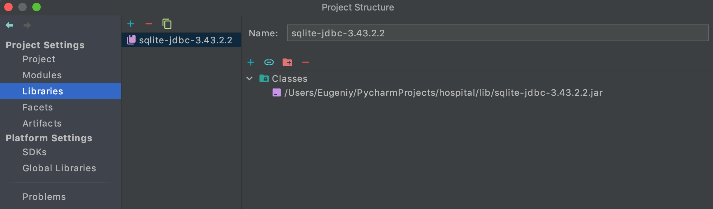
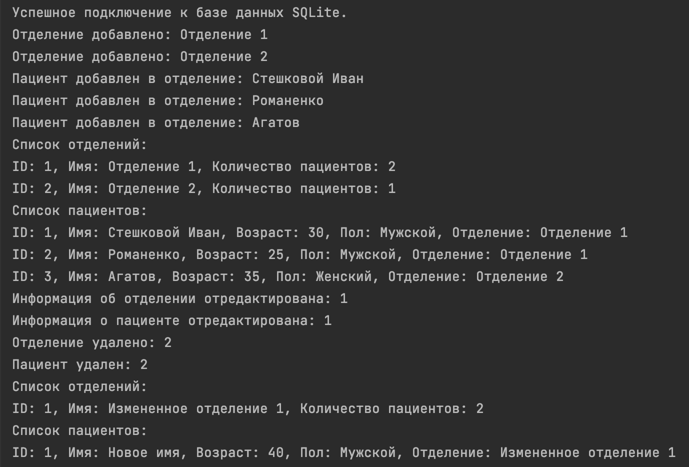
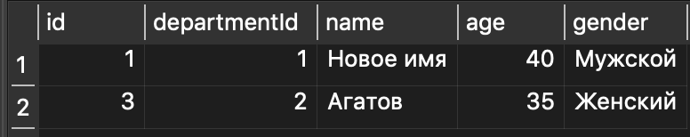
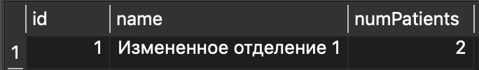

# HospitalInfoSystem
Java-приложение для управления информацией о пациентах и отделениях в больнице с использованием SQLite

## Развертывание проекта
1. Сделать клон проекта "git clone https://github.com/AppleIpx/java-hospital-app.git"
2. Необходимо скачать драйвер JDBC для связки с БД "https://github.com/xerial/sqlite-jdbc"
3. Создайте папку "lib" в вашем проекте
4. Положите JAR-файл в папку "lib"
5. Добавьте JAR-файл в класспас:
   - необходимо зайти в Project Structure
   - 
   - Заходим во вкладку "libraris" и добавить наш файл "+"
   - 
6. Теперь вы можете использовать JDBC для взаимодействия с базой данных SQLite

## Техническое задание (ТЗ)

## 1. Введение

### 1.1 Описание проекта
HospitalInfoSystem - это приложение для больницы для отображения информации об больных и отделениях

### 1.2 Контекст проекта
Проект **HospitalInfoSystem** создан с целью улучшить управление информацией в больничной среде, 
обеспечив более эффективное взаимодействие и обслуживание пациентов. 

## 2. Задание

Больница. Отделение: название, кол-во пациентов. Пациент: ФИо, возраст, пол.
добавлять отделение/пациентов в него,
удалять отделение/пациентов из него,
редактирование отделения/пациентов. Добавление/удаление пациента в отделение увеличивает/уменьшает 
кол-во автоматически. Выводить информацию по отделениям (пациентов). 
Выводить информацию по пациентам (весь список с указанием отделения).

### 2.1 Результат задачи:
После выполнения кода в проекте **HospitalInfoSystem** достигнуты следующие результаты:

- Реализована функциональность по добавлению новых отделений в базу данных, обеспечивающая беспроблемное расширение списка отделений больницы.

- Методы удаления отделений и пациентов взаимодействуют с базой данных, обеспечивая целостность и актуальность данных.

- Реализован механизм автоматического обновления количества пациентов в отделении при добавлении нового пациента или удалении существующего.

- Созданы методы для добавления, удаления и редактирования информации о пациентах, с учетом их привязки к конкретным отделениям.

- Реализованы функции вывода информации о всех отделениях и пациентах для наглядного мониторинга состояния больницы.

Эти результаты подчеркивают успешное внедрение функций управления отделениями и пациентами в больничной среде с использованием **HospitalInfoSystem**.

Отображение в консоле
- 
Значения в БД
- 
- 

